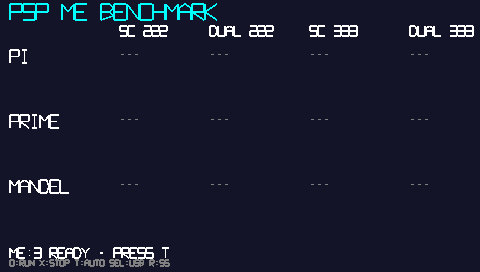

# PSP ME Benchmark

The world's first PSP Media Engine dual benchmark.
Measures real-world performance gains from the ME by running 3 benchmarks across 4 patterns: Single CPU vs Dual CPU (ME parallel) × Clock speed (222/333MHz).

## Screenshot



## Results

Speedup relative to SC 222MHz (identical on PSP-1000 and PSP-3000):

| Bench | SC 222 | DUAL 222 | SC 333 | DUAL 333 |
|-------|--------|----------|--------|----------|
| PI | x1.00 | x2.00 | x1.50 | **x3.01** |
| PRIME | x1.00 | x2.89 | x1.50 | **x4.33** |
| MANDEL | x1.00 | x2.07 | x1.50 | **x3.09** |
| **Average** | x1.00 | x2.32 | x1.50 | **x3.48** |

- No performance difference between PSP-1000 and PSP-3000 (same Allegrex core)
- Checksums verify identical computation results across all patterns

## Benchmarks

| # | Test | Description | Parameters |
|---|------|-------------|------------|
| 1 | PI | Leibniz series π calculation | 1,000,000 terms |
| 2 | PRIME | Trial division prime counting | up to 100,000 |
| 3 | MANDEL | Mandelbrot set computation | 160×120, max 64 iterations |

In DUAL mode, the workload is split in half between the main CPU (SC) and the Media Engine (ME) for parallel execution.

## Controls

| Button | Function |
|--------|----------|
| △ | Run all (4 patterns × 3 benchmarks) |
| ○ | Run next unfinished benchmark |
| × | Abort |
| START | Save CSV (`ms0:/me_bench.csv`) |
| SELECT | Toggle USB connection (no need to return to XMB) |
| R | Save screenshot (`ms0:/mebench_N.bmp`) |

## Setup

### Requirements
- PSP with CFW (PSP-1000 / 2000 / 3000)
- Memory Stick

### Instructions

Pre-built binaries (`EBOOT.PBP` and `tiny-me/build/kernel/kcall.prx`) are included in the repository. No build environment required.

1. **Copy kcall.prx** from `tiny-me/build/kernel/kcall.prx` to your Memory Stick:
   ```
   ms0:/seplugins/kcall.prx
   ```

2. **Register the seplugin**

   Create or append to `ms0:/seplugins/game.txt`:
   ```
   ms0:/seplugins/kcall.prx 1
   ```

3. **Copy EBOOT.PBP** to your Memory Stick:
   ```
   ms0:/PSP/GAME/MEBENCH/EBOOT.PBP
   ```

4. **Reboot your PSP** (required for kcall.prx to load)

5. **Set CFW clock to "Default"** (setting it to 333MHz fixed causes the clock API to be ignored)

6. **Launch ME Benchmark from XMB** → press △ to run all benchmarks

### About kcall.prx
kcall.prx is a kernel-mode plugin required by the Tiny-ME library to access the Media Engine. Both PSP-1000 and PSP-3000 require this plugin to be installed.

## Building

### Requirements
- [PSPDEV toolchain](https://github.com/pspdev/pspdev)

### Build
```bash
make clean
make
```

This produces `EBOOT.PBP`.

## Technical Details

- **ME communication**: Uncached shared memory for command/status/result passing
- **Timer**: `sceKernelGetSystemTimeLow()` (1MHz hardware register, CPU clock independent)
- **ME-side timer**: COP0 Count register ($9) (CPU_CLOCK/2, kernel mode)
- **Clock control**: `scePowerSetClockFrequency()` (API max 333MHz)

## Tested On
- PSP-1000 (FAT) — me_init_ret=3, FAT table
- PSP-3000 (Slim+) — me_init_ret=2, T2 table

## License

This project is licensed under [GPL-3.0](LICENSE).

The Tiny-ME library (`tiny-me/`) is licensed under the [MIT License](tiny-me/LICENSE.md) (c) 2025 m-c/d.

## Credits

- [Tiny-ME](https://github.com/mcidclan/tiny-me) — PSP Media Engine Core Mapper Library by m-c/d
- PSPDev toolchain & community
